import { Image } from 'astro:assets';
import imgwhybrowserediti2 from '../../images/why-browser-editing-secure-2.jpg';
import imgwhybrowserediti3 from '../../images/why-browser-editing-secure-3.jpg';
import imgwhybrowserediti1 from '../../images/why-browser-editing-secure-1.jpg';


Most online audio tools today still rely on server-side processing. You upload your file, it gets processed somewhere else, and then you download the result. This creates privacy concerns, especially for **journalists, lawyers, doctors, and anyone handling confidential audio**.

<Image src={imgwhybrowserediti2} alt="Studio microphone setup for confidential audio recording" />

## The Problem with Traditional Online Audio Tools

Many existing tools are:

- Limited to one basic function
- Outdated or poorly optimized
- Dependent on servers (your files get uploaded)
- Missing creative flexibility
- Locked behind sign-ups or paywalls

When you use a server-based tool, your audio file travels over the internet and sits on someone else's hardware indefinitely. This is a significant risk for sensitive content like unpublished interviews, legal recordings, or medical consultations.

## How Browser-Based Processing Works

Modern browsers support **WebAssembly (WASM)**—a technology that allows high-performance processing to run directly in your browser .

When you use a browser-based audio editor:

- **All processing happens locally** in your browser using WebAssembly
- **No file is ever uploaded** to any server
- **No storage of user files** occurs on external systems
- **No sign-up is required** to use the tool
- **No data tracking** of your audio content happens

Your audio never leaves your device .

## Key Privacy Principles

Here's what browser-based audio editing tools commit to:

| Principle | Description |
|-----------|-------------|
| Local Processing | All audio editing occurs entirely within your web browser. Your audio files are never uploaded to servers, transmitted over the internet, or stored on external systems. |
| No User Accounts | The service does not require user registration or account creation. No personal information or user profiles are stored. |
| Data Ownership | You retain full ownership and rights to all audio files you process. The service claims no ownership or licenses to your content. |
| Analytics Only | Analytics data is anonymized and does not include your audio files or personal content. |

<Image src={imgwhybrowserediti3} alt="Browser-based audio editor showing waveform with privacy toggle" />

## Technical Security of the Browser Sandbox

The browser's security sandbox enforces strict isolation for WebAssembly-based processing :

- **No filesystem access** — code cannot read or write files on your computer
- **No network access to origin** — code cannot make requests to hosting servers' internal APIs
- **No access to other users' data** — each browser tab runs its own isolated instance
- **No OS-level access** — system calls and hardware access are blocked

This means malicious code in the editor can at worst freeze the tab or consume memory. It cannot affect your server, your files, or other visitors .

## Who Benefits from Browser-Based Editing?

### Journalists
When interviewing a whistleblower or covering a sensitive story, the audio file must remain confidential. Uploading it to a cloud server creates a digital trail that could compromise sources.

### Lawyers and Legal Professionals
Client consultations, deposition recordings, and case notes are highly sensitive. Local processing ensures these files never leave your device.

### Medical and Healthcare Workers
Patient conversations and medical recordings are protected by privacy regulations like HIPAA. Browser-based processing provides an extra layer of security.

### Businesses with NDA Content
Product briefings, internal meetings, and confidential discussions shouldn't be uploaded to third-party servers. Local processing keeps corporate secrets safe.

<Image src={imgwhybrowserediti1} alt="Turntable with laptop – secure audio editing workspace" />

## 📊 Privacy Comparison: Browser vs. Server-Based Tools

Here's a breakdown of how browser-based tools compare to traditional server-based audio editors:

| Feature | Browser-Based (WASM) | Server-Based |
|---------|---------------------|--------------|
| File Upload | None | Required |
| Server Storage | None | Yes (indefinite) |
| Sign-Up Required | No | Often yes |
| Data Tracking | No | Often yes |
| Processing Speed | Instant (local) | Depends on server load |
| Works Offline | Yes (after initial load) | No |

*Mermaid chart (if supported):*

```mermaid
xychart-beta
    title "Privacy Features: Browser vs Server-Based Tools"
    x-axis ["File Upload", "Server Storage", "Sign-Up", "Data Tracking"]
    y-axis "Privacy Score (0-100)" 0 --> 100
    bar [100, 100, 100, 100]
    bar [0, 0, 25, 40]
```



ASCII fallback (copy-friendly):

```text
Browser:  ======================================== (100/100)
Server:   == (0/100)  == (0/100)  ========= (25/100)  ================ (40/100)
```

Result: Browser-based tools score 100% on privacy features while server-based tools fall significantly short.

Why WebAssembly Makes This Possible

WebAssembly enables near-native performance for audio processing directly in the browser . This means:

· A 60-minute MP3 can change speed in under 5 seconds on modern hardware
· Complex audio manipulation runs smoothly without lag
· Processing works offline after the initial page load

Important Security Consideration

Browser-based processing provides privacy, but it is not designed to protect proprietary code or secrets from being viewed by users. According to OWASP guidelines, client-side code is visible to the user and can be bypassed .

Use browser-based editing for: Protecting user audio files from being uploaded or tracked.

Do not use it for: Embedding API keys, proprietary algorithms, or enforcing access control in your application.

Conclusion

Browser-based audio editing represents a paradigm shift in how we handle sensitive audio content. By keeping processing local using WebAssembly technology, you get the best of both worlds: professional-grade editing capabilities and complete privacy for your files.

For anyone handling confidential audio—journalists, lawyers, doctors, or businesses—browser-based tools are no longer a compromise. They're the safest choice.

Explore Dayront's Privacy-First Tools or Try the Audio Cutter.

```